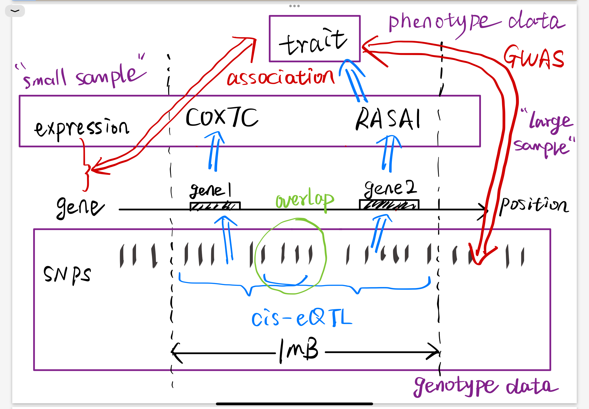

# TWAS and GIFT

## TWAS

TWASs aim to integrate genome-wide association studies (GWASs) with gene expression-mapping studies to identify genes with genetically predicted expression (GReX) associated with a complex trait of interest.

### 3 stages:

For individual-level data, TWAS first trains a genetic regulation model of genetic components and gene expression from **a small available reference panel**. These models with regulatory weights are used to impute gene expression for individuals of **larger GWAS cohorts**. Finally, the associations between predictive gene expression and traits are calculated to determine the regulatory relationship between genes and traits.

> However, for most tissue types, human biospecimens are very difficult to obtain from living donors (for example, brain, heart and pancreas), and most eQTL studies so far have been performed with RNA isolated from immortalized lymphoblasts or lymphocytes6 and a few additional readily sampled tissues.

① Training stage: Estimate regulatory effect sizes of multiple SNPs on the gene expression level from a small reference panel with genotype and expression data. As the number of samples is often less than that of variables, they applied penalized regression or Bayesian models for filtering important SNPs and avoiding overfitting. (e.g., LASSO, elastic net, BSLMM, ...)

② Prediction/Imputation stage: Obtain the predicted gene expression level of GWAS individuals. 

③ Association stage: Implement hypothesis tests between predicted gene expression and the target trait with different statistic association models. (e.g., linear, logistic, Spearman,...)

### Extension:

- summary statistics:

> In FUSION, the effect size of a given gene on a trait was defined with the linear combination of the estimated SNP-expression effect sizes and standardized SNP-trait effect sizes, which is subsequently used to analyze the gene-trait associations.

- Mendelian randomization (MR): 

> Mathematically, TWAS can be viewed as a two-sample MR analysis with eQTL panel and GWAS panel implementing 2SLS method independently, which aims to infer causal effect from gene expression to the trait.

- multi-ancestry: e.g., TESLA, MATS,...

- Aggregation model: e.g., Harmonic Mean P value Aggregated TWAS

- fine-mapping: e.g., FOCUS, FOGS,...

### Reference:

- Mai et al., Transcriptome-wide association studies: recent advances in methods, applications and available databases.
- Wainberg et al., Opportunities and Challenges for Transcriptome-Wide Association Studies.
- Gusev et al., Integrative Approaches for Large-Scale Transcriptome-Wide Association Studies.
- Lonsdale et al., The Genotype-Tissue Expression (GTEx) Project.

## GIFT

GIFT (gene-based integrative fine-mapping through conditional TWAS), examines one genomic region at a time, **jointly models** the GReX of all genes residing in the focal region and carries out TWAS conditional analysis in a maximum likelihood framework.

$$
\begin{align}
    \mathbf{x}_i&=Z_i\boldsymbol{\beta}_i+\mathbf{e}_i,i=1,\cdots,k,\\
    \mathbf{y}&=\sum_{i=1}^k\alpha_i(\tilde{Z}_i\boldsymbol{\beta}_i)+\tilde{\mathbf{e}},
\end{align}
$$

$\mathbf{x}_i(n_1\times 1)$: expression levels for the $i$-th gene
$\mathbf{y}(n_2\times 1)$: phenotypic measurement
$Z_i(n_1\times p_i)$: $i$-th genotype matrix in the expression data
$\tilde{Z}_i(n_2\times p_i)$: $i$-th genotype matrix for the same SNPs in the GWAS data
$\boldsymbol{\beta}_i(p_i\times 1)$: SNP effect sizes on the $i$-th gene expression

### Advantages:

- conditional TWAS analysis:

> GIFT is **frequentist** and places TWAS fine-mapping into a conditional TWAS testing framework, with a joint likelihood that accounts for the uncertainty in constructing the GReX to achieve high power. 
> 
> Null hypotheses $H_0: \alpha_i=0$. Rejecting $\alpha_i=0$ would suggest that the $i$-th gene has a nonzero effect on the outcome, **conditional on the effects of the other genes**.

- joint likelihood inference framework

> Previous TWAS fine-mapping approaches rely on a two-stage regression approach, which would perform inference on the two equations in a sequential fashion.
>
> Joint inference framework accounts for the uncertainty in the SNP effect-size estimates on gene expression and subsequently the uncertainty in the constructed GReX, thus ensuring high statistical power.

- Extension: e.g., multiple tissue types, trans-ancestry,...

### software

- Using individual-level data as input

- Using summary statistics as input

- Two-stage version of GIFT: Using pre-trained weights and summary statistics

It facilitates the use of pre-computed gene expression  prediction models and enhance computational efficiency. The two-stage version of GIFT is equivalent to the naïve approach of adjusting for marginal TWAS z-scores.

For simulation, $k=4, p=223, n_1=465, n_2=5000$.

### Reference:

- Liu et al., Conditional Transcriptome-Wide Association Study for Fine-Mapping Candidate Causal Genes.
