# GIFT simulation and real data analysis

[toc]

## Simulation

### Data generation

Take individual-level data as an example:

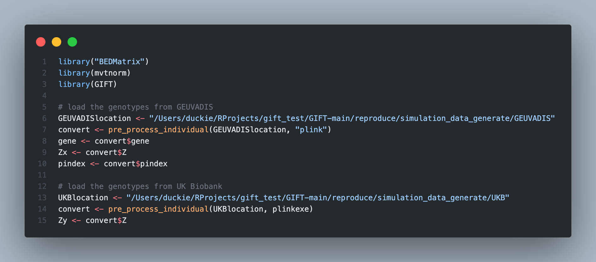

For individual-level data, we can specify the structure of R in the simulation: 

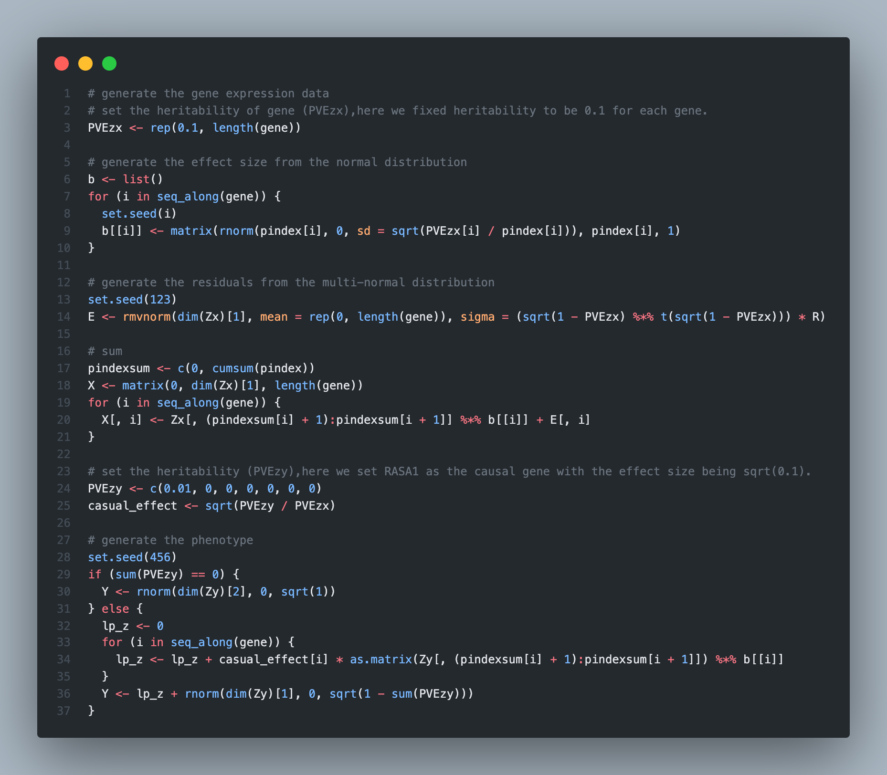

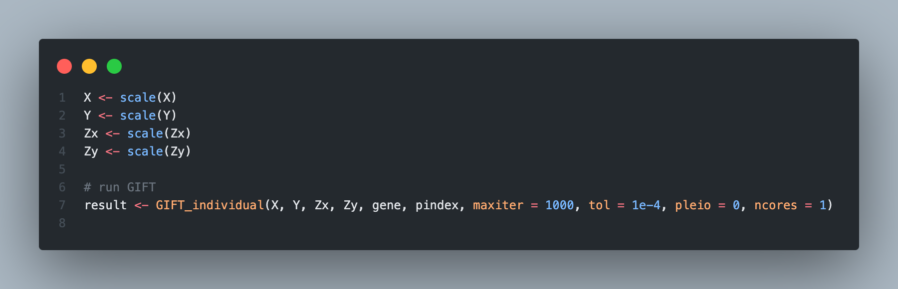

### Null simulations and Q-Q plots

Here, we only consider three **frequentist methods**. ~~All points in Fig.2a and Fig.2b are **noncausal genes**.~~ In the setting of Fig.2a, all genes are null and in the setting of Fig.2b, each group has only one causal gene. 

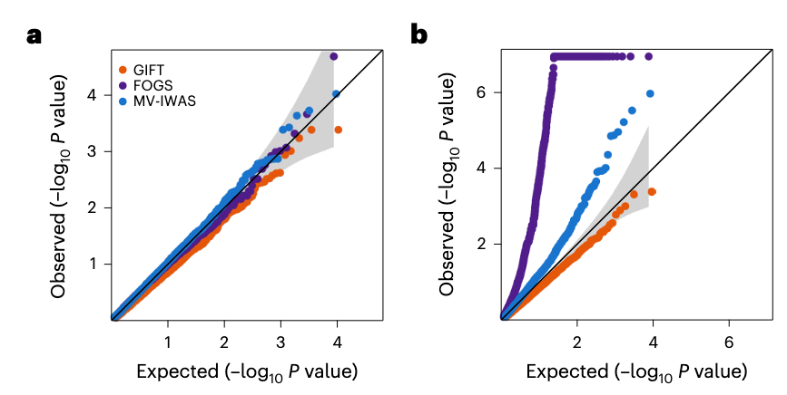

Clearly, for Fig.2a, GIFT, FOGS, and MV-IWAS all provided well-calibrated type I error control results. 

For Fig.2b, the observed p-value's negative logarithm for noncausal genes is higher than expected for FOGS and MV-IWAS, indicating inflation in these two methods. GIFT, provided a more conservative p-value estimate, effectively controlling the type I error.

> ~~Since Fig.2b only plots non-causal gene points, around $\text{p-value}=10^{-4}$, the observed $-\log_{10}$P value should be lower than the expected $-\log_{10}$P value if the model is correct.~~

Additionally, GIFT conducted the most challenging null-simulation settings where the causal genes in the region were not included in the analysis (masked simulations, whose results not shown in the main text). At this time, none of the frequentist methods produced calibrated type I error control. FOCUS yielded inflated FDR estimates and 20.62% of the credible sets from FOCUS also included genes.

### Alternative simulations and power

Here, we only consider three frequentist methods GIFT, FOGS, MV-IWAS and the 90% credible sets for the Bayesian method (FOCUS).

When there is one causal gene in the region and it explains 1% of phenotypic variance, the FDR and power under the **recommended thresholds** from different methods as follows:

| Methods | FDR | power |
| :----: | :----: | :----: |
| GIFT | 0% | 46.8% |
| FOCUS | 42.1% | 70.6% |
| FOGS | 39.6% | 49.6% |
| MV-IWAS | 0.5% | 56.2% |

** the stringent Bonferroni’s adjusted P-value threshold (0.05/5,480) for the 3 frequentist methods (GIFT, FOGS and MV-IWAS) and the 90% credible sets for the Bayesian method (FOCUS).

As the threshold for GIFT corresponds to a much lower FDR than the other three methods, such a threshold naturally leads to a lower power for GIFT. To allow for fair, they further computed power **based on a true FDR of 0.05**:

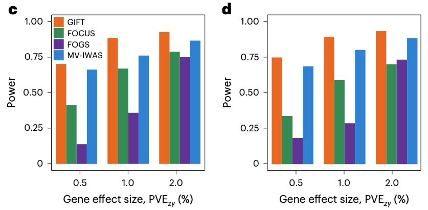

As the true FDR is known only in simulations but unknown for any real dataset, they also used P-value to compared power **based on the estimated FDR of 0.05**:

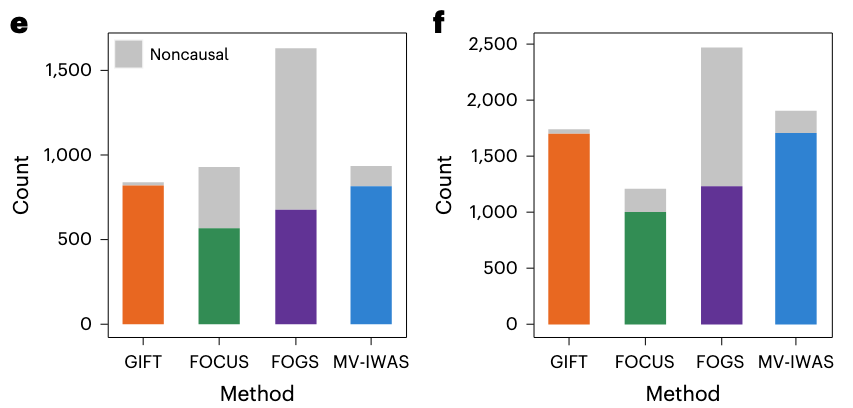

In the setting of Fig.2c, Fig.2e, each group has only one causal gene and in the setting of Fig.2d, Fig.2f, each group has two causal genes. Fig.2e and Fig.2f record number of genes identified by different methods and the ${PVE}_{zy}$ of Fig.2e and Fig.2f is 1%. 

** For the three frequentist methods, they used the Benjamini-Hochberg approach to estimate FDR. For the Bayesian method FOCUS, they used the local FDR approach to estimate FDR. 

- Bonferroni Correction and FWER, Benjamini-Hochberg and FDR: https://stats.libretexts.org/Bookshelves/Applied_Statistics/Biological_Statistics_(McDonald)/06%3A_Multiple_Tests/6.01%3A_Multiple_Comparisons
- local FDR: https://projecteuclid.org/journals/annals-of-statistics/volume-35/issue-4/Size-power-and-false-discovery-rates/10.1214/009053606000001460.full

### Estimation of the causal gene effects

GIFT also produces accurate and unbiased estimates of the causal gene effects on the trait under both the null and the various alternatives. In contrast, none of the other methods was able to estimate the causal gene effects.

Boxplots display causal effect estimates by GIFT across 1,000 regions:

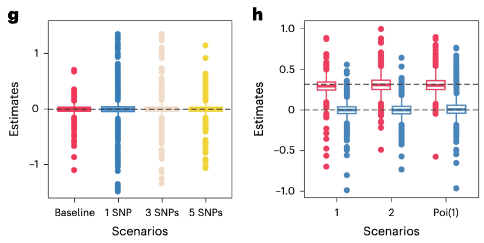

Simulations are performed under the null settings (Fig.2g) where either all SNPs have effects on gene expression (baseline) or 1/3/5 SNPs have effects on gene expression, as well as under the alternative settings (Fig.2h) where the number of causal genes within one region is one, two or randomly sampled from Poi(1). The horizontal dashed lines represent the true gene effect sizes for the causal ($\alpha=\sqrt{0.1}$) or noncausal genes ($\alpha=0$).

## Real-data applications

### Data generation

> - For GEUVADIS data, we focused on protein-coding genes and long intergenic noncoding RNAs (lincRNAs) that are annotated in GENCODE (release 12).
>
> - For each gene within a genomic region, we extracted its cis-SNPs that are within either 100 kb upstream of its transcription start site or 100 kb downstream of its transcription end site. We then overlapped the extracted cis-SNPs in GEUVADIS with the SNPs in the UK Biobank to obtain common sets of cis-SNPs.
>
> - For these traits, we obtained their GWAS summary statistics and identified GWAS risk regions that contain at least one genome-wide significant SNP ( $p<5\times 10^{-8}$ ) associated with at least one trait.
> 
> - Next, we performed a marginal TWAS analysis using FUSION to identify significant genes residing in TWAS risk regions, most of which are also GWAS risk regions and over half of which contain multiple genes with significant marginal TWAS evidence across 6 traits.
>
> - For regions that harbor both marginal GWAS and marginal TWAS signals, we further removed SNPs with a GWAS $p>0.05$

- In addition to the above, complex quality control procedures were performed on data from both GEUVADIS and UK Biobank. For example, low-expression genes with zero counts were removed, PEER normalization was conducted, filtering was done based on Hardy-Weinberg equilibrium and MAF, and SNPs with allele mismatches were deleted.

### Quantitative result analysis

Here, we only use two blood pressure traits (SBP, DBP) as examples to analyze the results of GIFT on real data.

> As the 90% credible sets from FOCUS probably contain an excessive number of false signals as shown in simulations, we used PIPs to estimate the FDR in FOCUS and declared significance **based on an empirical FDR threshold of 0.05**, a threshold that is also used to declare significance for GIFT, FOGS and MV-IWAS. 
>
> Again, we estimated empirical FDR using the Benjamini–Hochberg approach for GIFT, FOGS and MV-IWAS, while using the local FDR approach43 for FOCUS.
>

    
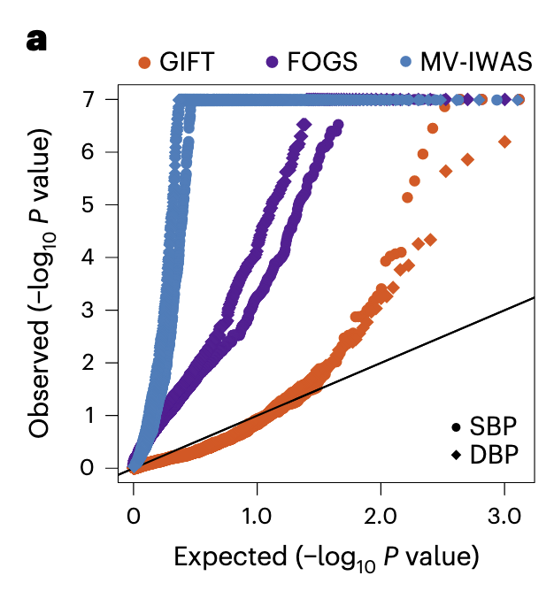

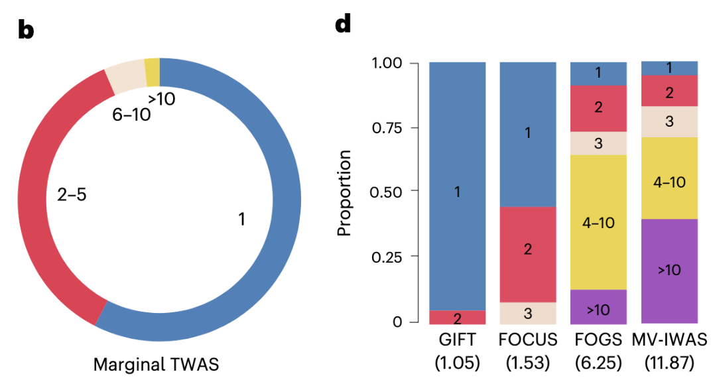

<!-->

    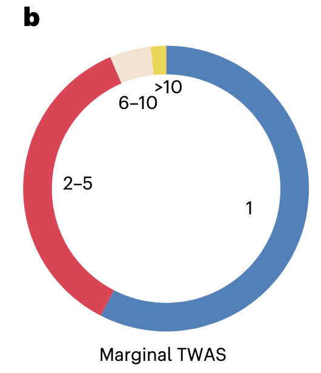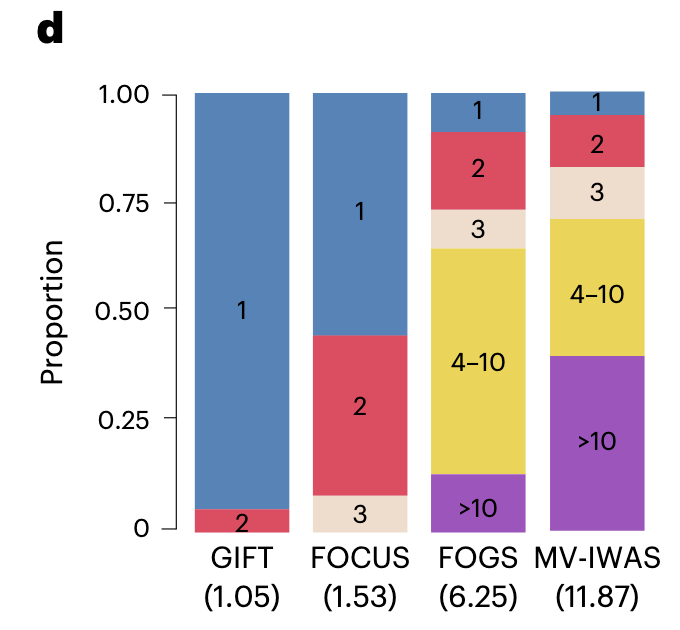

<-->

> Comparing across methods, the significant genes identified by different methods share a substantial overlap (Extended Data Fig. 5d–i). **However, GIFT identified the smallest set of genes per region among the four methods, supporting its superior performance in refining the causal gene sets.** A careful examination shows that GIFT refined the causal gene set in many regions compared with FOCUS, FOGS and MV-IWAS.

### Biological relevance

Here, we only use two blood pressure traits (SBP, DBP) as examples to analyze the results of GIFT on real data.

    

    

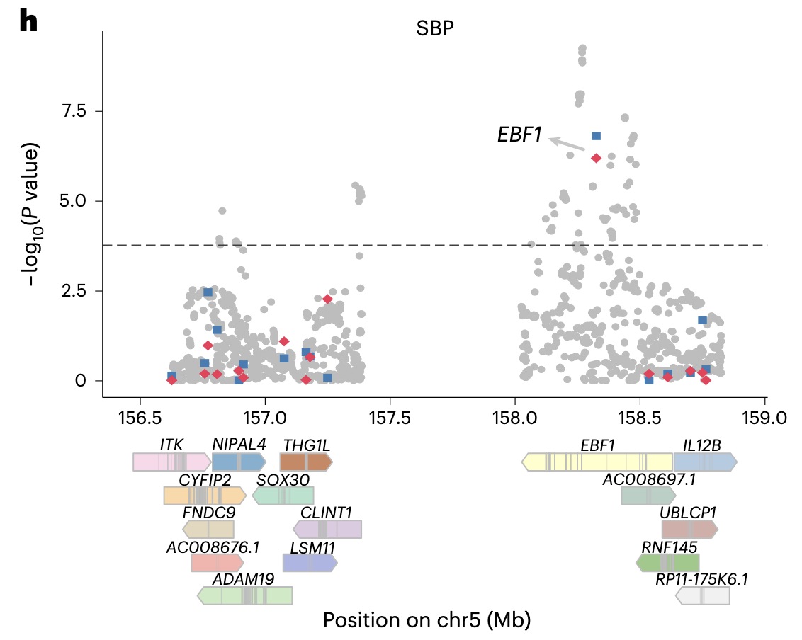

Gray circle represents each SNP from GWASs; Blue square represents each gene from marginal TWASs; Red diamond represents each gene from GIFT.

The analysis indicates that GIFT refined the causal gene set more effectively in many regions compared to FOCUS, FOGS, and MV-IWAS. For instance, in an area on chromosome 5 (156,628,700-158,825,698) containing 16 genes, **GIFT identified EBF1 as the only gene associated with SBP.** In extensive GWAS studies, EBF1 has been linked to blood pressure and is involved in angiogenesis and vessel maintenance. In contrast, FOCUS, FOGS, and MV-IWAS identified additional genes in the same region, but no substantial evidence supports their causal role in regulating blood pressure. 

> Reference:
> 
> 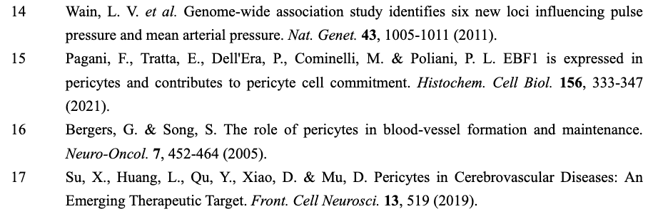

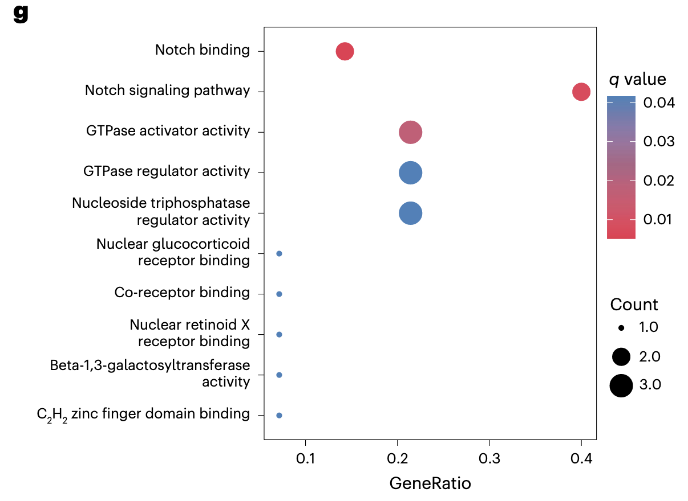

Gene ontology (GO) and KEGG pathway enrichment analysis examined the biological relevance of genes identified by different methods. For blood pressure traits, GIFT identified genes enriched in ten significant pathways, emphasizing the role of direct vessel regulation in determining blood pressure. In contrast, FOGS and MV-IWAS each identified genes enriched in only one considerable pathway, and FOCUS did not identify any significant pathways.

