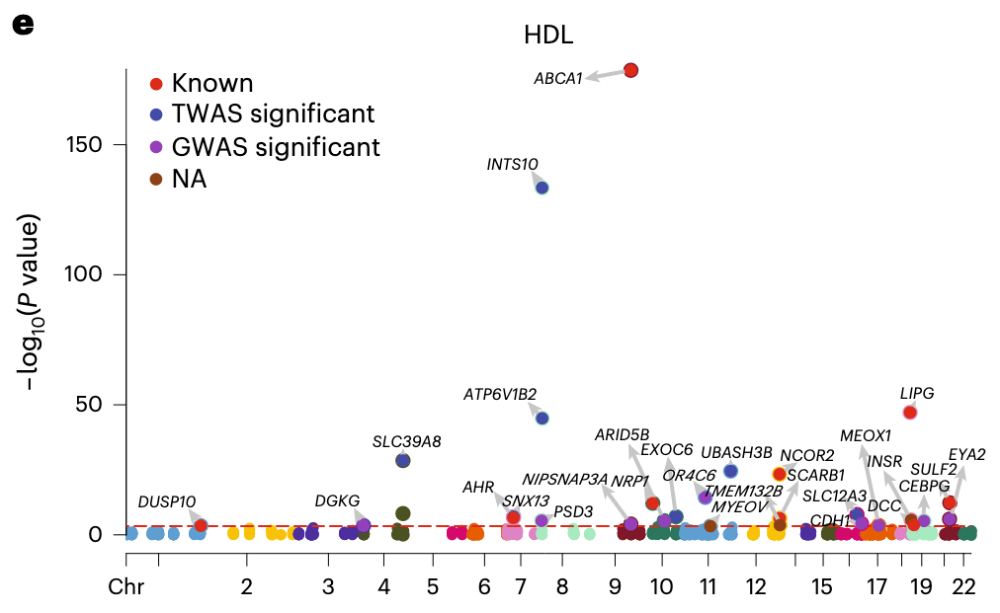
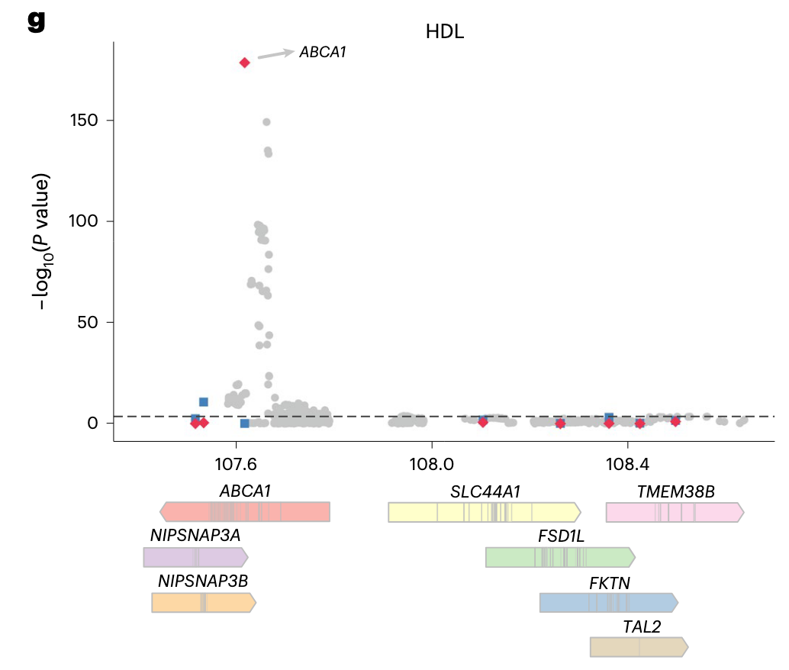
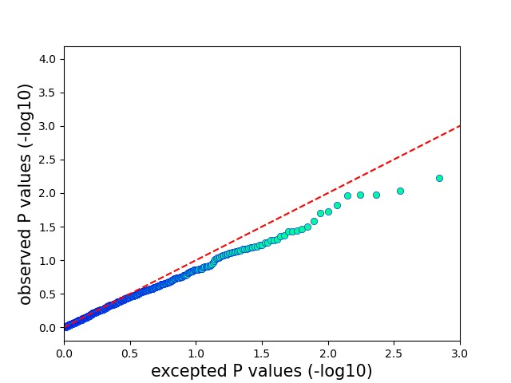
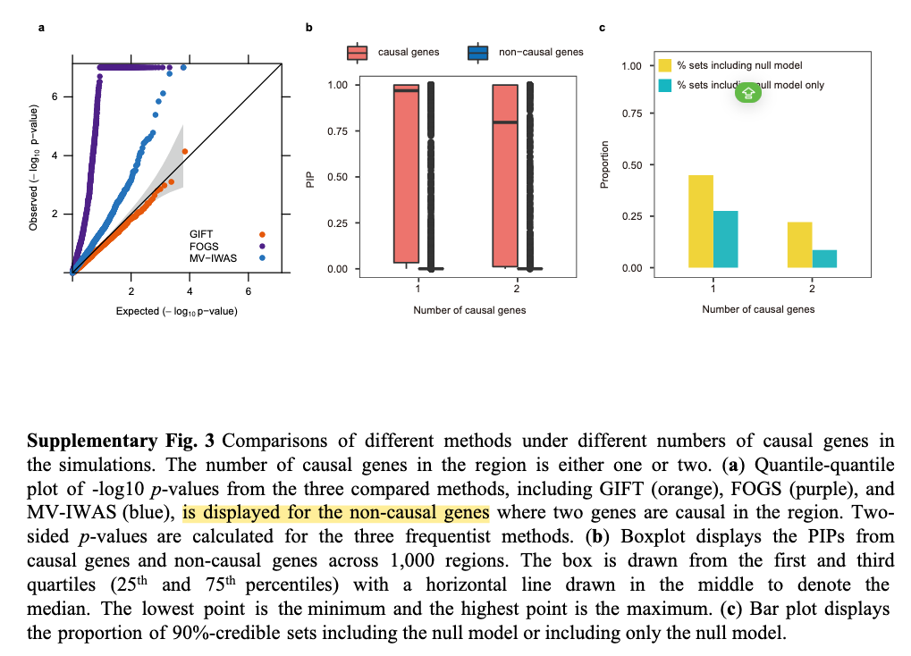
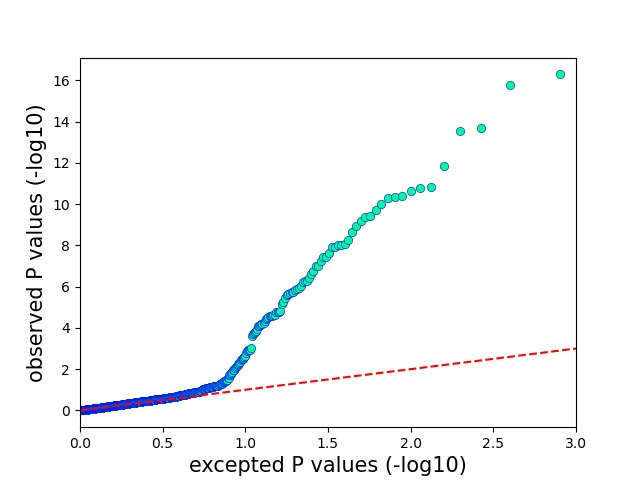
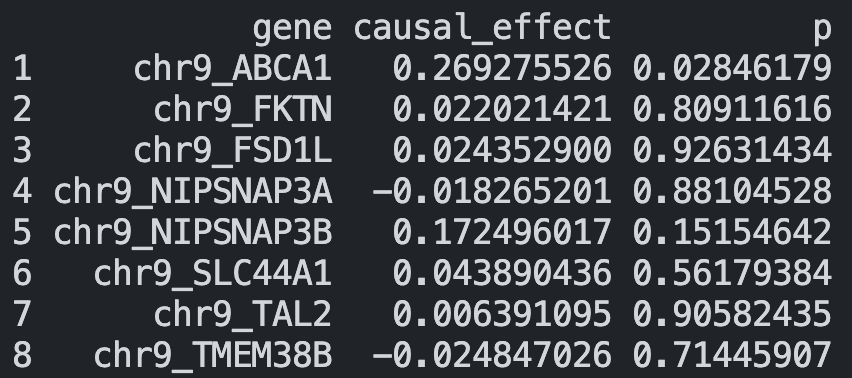

# GIFT simulation

## Simulation setup 

We selected the region (chr9, 107581749-109298754) corresponding to Fig. 4g for simulation, which includes $m=8$ genes. Among them, ABCA1 is considered by GIFT to be the gene most closely related to HDL in real data analysis:

    

    

We obtained the .bed data from GEUVADIS and UK Biobank, and extracted the corresponding 8 gene regions based on https://github.com/yuanzhongshang/GIFT/blob/main/reproduce/gencodev12.tsv. Then, we took the intersection of SNPs from the GEUVADIS and UK Biobank data. Now, the number of eQTL SNPs corresponding to each gene is as follows:

| Gene ID | Number of SNPs |
| :----: | :----: |
| ABCA1 | 141 |
| FKTN | 63 |
| FSD1L | 51 |
| NIPSNAP3A | 79 |
| NIPSNAP3B | 75 |
| SLC44A1 | 61 |
| TAL2 | 37 |
| TMEM38B | 48 |
| total | $p=555$ |

We used the GIFT function pre_process_individual to read the .bed files. This function removes samples with missing values. For the GEUVADIS data, the final sample size was $n_1=379$. For the UK Biobank data, about 50% of the rows had missing values. Therefore, we used plink to retain 10,000 samples, and after reading with pre_process_individual, $n_2=5446$ samples remained.

The other hyperparameter are shown in the table below:

| Parameters | Settings |
| :----: | :----: |
| correlation matrix | exponential covariance structure |
| number of simulations | 100 $\times$ 2 |
| number of casual genes | 0 or 1 |
| PVEzx | all SNPs with 0.1 |
| PVEzy | 0.01 |
| casual effect | sqrt (PVEzy / PVEzx) = sqrt(0.1) |
| seed | k+500, k+1000, i*k+1 |
| GIFT parameters| default |

Under the above data scale and parameter settings, running GIFT once takes approximately 1 minute.

## Simulation results

### Null simulations 

- For the complete null-simulation settings where all genes in the region have zero effects on the outcome trait: 
  

    

- For null-simulation settings where both the null and causal genes are present in the same region:

> GIFT supplementary Figs show that the q-q plot only includes non-causal gene points: 
>
> 

    

### Power and FDR

- For recommended threshold (Bonferroni’s adjusted P-value 0.05/m):

**Method: GIFT**

| thresholds | FDR | power  |
| :----: | :----: | :----: |
| 0.05 / 800 | 0% | 63% |
| 0.05 / 5480 | 0% | 49% |

> Results in GIFT paper:
> (Bonferroni’s adjusted P-value 0.05/5480)
> 

>
> | Methods | FDR | power |
> | :----: | :----: | :----: |
> | GIFT | 0% | 46.8% |
> | FOCUS | 42.1% | 70.6% |
> | FOGS | 39.6% | 49.6% |
> | MV-IWAS | 0.5% | 56.2% |
>
> 

This indicates that using Bonferroni’s adjusted P-value for the GIFT method results is **over-calibrated**.

- For true FDR 0.05:

> For each alternative simulation setting, we first divided 20 simulation replicates into five groups, with four replicates per group. We then calculated power per FDR in each group separately. In each group, we obtained the test statistics from each method for all genes across the four replicates ... Afterwards, we obtained the average power across five groups

In our simulations, we devided 100 simulation replicates into 5 groups, with 20 replicates per groups. That is because the threshold $0.05=1/20$.

Across five groups, **The average power is 0.9**, which is close to the results of GIFT.

- For estimated FDR 0.05:

| | Predict Positive | Predict Negative |
| :----: | :----: | :----: |
| **Reference Positive** | 88 | 12 |
| **Reference Negative** | 1 | 699 |

The result is also close to GIFT paper.

### Others

- The impact of sample size on GIFT results:

When $n=2000$, the power is not high, and false positives may occur:

Actually, the true casual gene is NIPSNAP3B.

