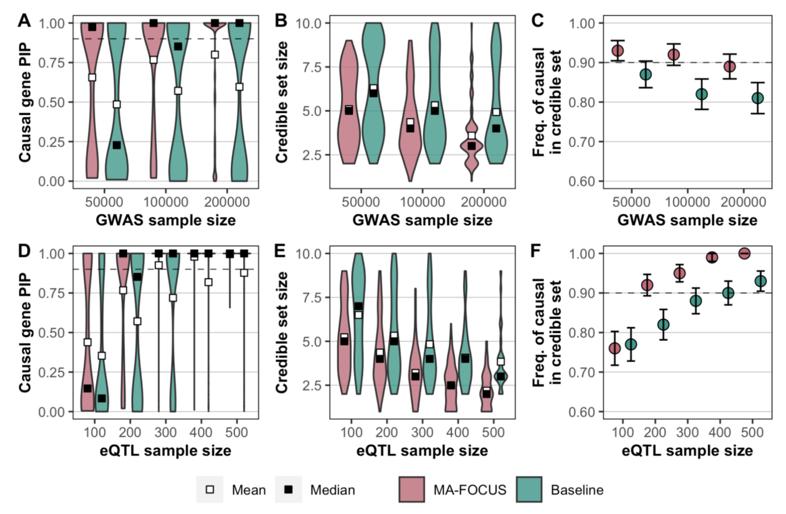
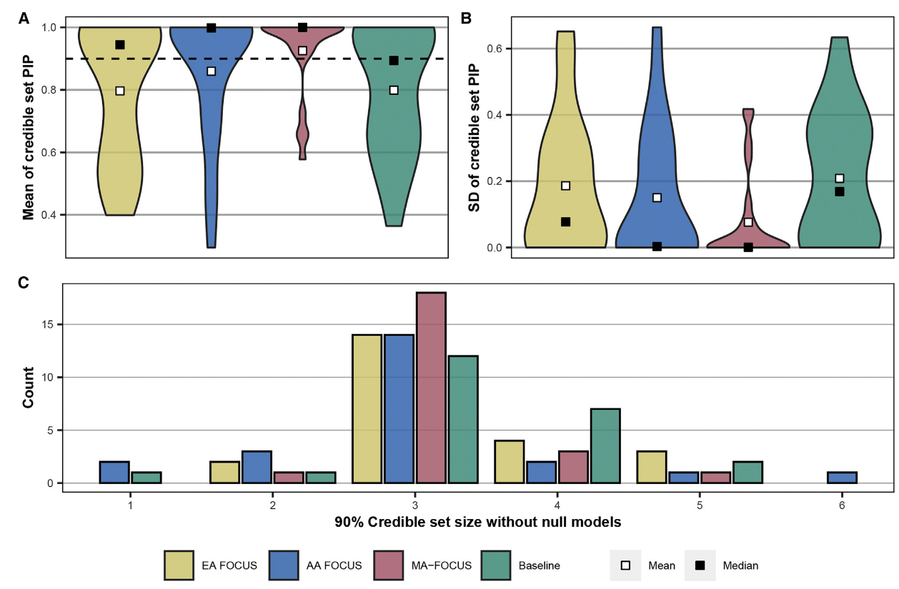

# MA-FOCUS & FOCUS

[toc]

## FOCUS Method

### Model with individual-level data

FOCUS (fine-mapping of causal gene sets), accounts for the correlation structure induced by LD and prediction weights used in the TWAS and controls for certain pleiotropic effects.

$$
\begin{align}
    \mathbf{y}&=\mathbf{X\bm\beta}+\mathbf{G\bm\alpha}+\tilde{\bm{\epsilon}} \\
    \mathbf{G}&=\mathbf{XW+E}
\end{align}
$$

$\mathbf{y}\in\mathbb{R}^{n\times 1}$: quantitative trait for n individuals.

$\mathbf{X}\in\mathbb{R}^{n\times p}$: centered and variance-standardized genome-wide genotype matrix at $p$ SNPs.

$\mathbf{G}\in\mathbb{R}^{n\times m}$: expression levels for the $m$ genes.

$\bm\alpha$: the vector of causal effects for the $m$ genes.

$\bm\beta$: pleiotropic effects of $\textbf{X}$ on $\textbf{y}$.

> Pleiotropy occurs when one gene influences two or more seemingly unrelated phenotypic traits. Such a gene that exhibits multiple phenotypic expression is called a pleiotropic gene. Mutation in a pleiotropic gene may have an effect on several traits simultaneously, due to the gene coding for a product used by a myriad of cells or different targets that have the same signaling function.

$\mathbf W$: the eQTL effect-size matrix, which must be **estimated from data** (e.g., BSLMM, GBLUP). 
Let predicted expression be defined as $\hat{\mathbf G}=\mathbf X \mathbf{\Omega}$ where $\mathbf{\Omega}$ are estimated eQTL effects.

$\tilde{\bm{\epsilon}}$ and $\mathbf E$: random environmental noise. $\mathbb{E}[\tilde{\bm\epsilon}]=\mathbf{0}$ and $\mathbb{V}[\tilde{\bm\epsilon}]=\mathbf{I}_n\tilde{\sigma}_e^2$.

Define $\bm\epsilon=\mathbf{E\bm\alpha}+\tilde{\bm\epsilon}$, which is the total contribution from environment. The updated model is:

$$
\begin{equation}
\mathbf{y}=\mathbf X\bm\beta+\mathbf{XW} \bm\alpha+\bm\epsilon
\end{equation}
$$

where $\mathbb{E}[\bm\epsilon]=\mathbf{0}$ and $\mathbb{V}[\bm\epsilon]=\mathbf{I}_n\sigma_e^2$, **which is valid provided independence of errors holds**.

### Model with marginal TWAS summary statistics

Specifically, we compute the marginal association $z_j$ of gene $j$ with $\mathbf y$ through a transcriptome-wide association study as:

$$
\begin{equation}
\begin{split}
z_j&=\frac{1}{\sigma_e\sqrt{n}}\hat{\mathbf{G}}_j^\mathrm{T}\mathbf{y} \\
&=\frac{1}{\sigma_e\sqrt{n}}(\mathbf{X}\mathbf{\Omega}_j)^\mathrm{T}\mathbf{y} \\
&=\frac{1}{\sigma_e\sqrt{n}}\boldsymbol{\Omega}_j^\mathrm{T}\mathbf{X}^\mathrm{T}\mathbf{y} \\
&=\frac{1}{\sigma_e\sqrt{n}}\boldsymbol{\Omega}_j^\mathrm{T}\mathbf{X}^\mathrm{T}(\mathbf{X}\boldsymbol{\beta}+\mathbf{X}\mathbf{W}\boldsymbol{\alpha}+\boldsymbol{\epsilon})\\
&=\frac1{\sigma_e\sqrt{n}}\big(\boldsymbol{\Omega}_j^\mathrm{T}\mathbf{X}^\mathrm{T}\mathbf{X}\boldsymbol{\beta}+\boldsymbol{\Omega}_j^\mathrm{T}\mathbf{X}^\mathrm{T}\mathbf{X}\mathbf{W}\boldsymbol{\alpha}+\boldsymbol{\Omega}_j^\mathrm{T}\mathbf{X}^\mathrm{T}\boldsymbol{\epsilon}\big)
\end{split}
\end{equation}
$$

Let $\mathbf{V}=n^{-1}\mathbf{X}^\mathrm{T}\mathbf{X}$ be the SNP correlation (LD) matrix. The marginal association statistics for $m$ nearby genes are determined by:

$$
\begin{equation}
\mathbf{z}_{\text{twas}}=\frac{\sqrt{n}}{\sigma_e}\boldsymbol{\Omega}^\mathrm{T}\mathbf{V}\bm{\beta}+\frac{\sqrt{n}}{\sigma_e}\boldsymbol{\Omega}^\mathrm{T}\mathbf{VW}\bm{\alpha}+\frac1{\sigma_e\sqrt{n}}\boldsymbol{\Omega}_j^\mathrm{T}\mathbf{X}^\mathrm{T}\boldsymbol{\epsilon}
\end{equation}
$$

Assuming weights $\bm\Omega$ and causal gene effects $\bm\alpha$ are fixed, we have:
$$
\begin{align}
\mathbb{E}[\mathbf{z}_\mathrm{twas}]&=\frac{\sqrt{n}}{\sigma_e}\bm\Omega^\mathrm{T}\mathbf{V}\bm\beta+\frac{\sqrt{n}}{\sigma_e}\bm\Omega^\mathrm{T}\mathbf{VW}\bm\alpha  \\
\mathbb{V}[\mathbf{z}_\mathrm{twas}]&=\frac{1}{\sigma_e^2n}\mathbf{\Omega}^\mathrm{T}\mathbf{X}^\mathrm{T}\mathbb{V}[\bm{\epsilon}]\mathbf{X}\mathbf{\Omega}=\mathbf{\Omega}^\mathrm{T}\mathbf{V}\mathbf{\Omega}
\end{align}
$$

- To simplify notation, we re-parameterize the causal effects as a non-centrality parameter (NCP) at the causal genes by $\bm\lambda_{\text{pe}}=\frac{\sqrt{n}}{\sigma_e}\bm\alpha$, and We parameterize $\bm\beta$ similarly as $\bm\lambda_{\text{snp}}=\frac{\sqrt{n}}{\sigma_e}\bm\beta$

- As sample size increases, We note that $\mathbf{\Omega}^\mathrm{T}\mathbf{V}\mathbf{\Omega}\rightarrow \mathbf{\Omega}^\mathrm{T}\mathbf{V}\mathbf{W}$ asymptotically, so we denote predicted expression covariance as $\mathcal{V}=\mathbf{\Omega}^{\mathrm{T}}\mathbf{V}\mathbf{\Omega}$

- we assume $\bm\epsilon\sim N(0,\mathbf{I}_n\sigma_e^2)$

Then our sampling distribution for $\mathbf{z}_{\text{twas}}$ is given by:

$$
\begin{equation}
\mathbf{z}_{\mathrm{twas}}|\bm\lambda_{\mathrm{snp}},\bm\lambda_{\mathrm{pe}},\bm\Omega,\mathbf{V}\sim N(\mathbf{\Omega}^{\mathrm{T}}\mathbf{V}\bm\lambda_{\mathrm{snp}}+\mathcal{V}\bm\lambda_{\mathrm{pe}},\mathcal{V})
\end{equation}
$$

> This formulation asserts that observed marginal TWAS Z-scores are the linear combination of  NCPs at causal genes weighted by the covariance structure of predicted expression $\mathcal{V}$ and tagged pleiotropic effects. Likewise, the resulting covariance structure $\mathcal{V}$ is the the  product of the underlying LD structure of SNPs $\mathbf{V}$ and the weight matrix learned from expression data $\mathbf{\Omega}$.

Computing the likelihood of $\mathbf{z}_{\mathrm{twas}}$ as described requires knowing $\mathcal{V}, \bm\lambda_{\mathrm{snp}}, \bm\lambda_{\mathrm{pe}}$, which are unknown a-priori.

- For $\mathcal{V}$, we can estimate it according to $\mathbf{V}$ and $\mathbf{\Omega}$.

- For $\bm\lambda_{\mathrm{snp}}$, while we can estimate $\bm\beta$ from data, it will  typically be the case that $p \gg m$, which limits inference. we make the simplifying assumption that $\bm\lambda_{\mathrm{snp}}=\mathbf{1}_p\lambda_{\mathrm{snp}}$ when conditioned on $\mathcal{V}, \bm\lambda_{\mathrm{pe}}$, which is similar to methods in robust Mendelian Randomization.

- For $\bm\lambda_{\mathrm{pe}}$, estimating it directly from data is also likely to overfit. To bypass this issue, we treat $\bm\lambda_{\mathrm{pe}}$ as a **nuisance parameter** and make an additional assumption as follows.

Assume that:

$$
\begin{equation}
\bm\lambda_{\mathrm{pe}}|\mathbf{c},\sigma_{c}^{2}{\sim}N(0,\mathbf{D}_{c})
\end{equation}
$$

where $\mathbf{D}_c=\mathrm{diag}(\frac{n\sigma_c^2}{|\mathbf c|}\cdot\mathbf{c})$ is the scaled prior causal effect variance matrix  and $\mathbf{c}$ is an $m\times 1$ binary vector indicating if $i$-th gene is causal. It results in the variance component model:

$$
\begin{equation}
\colorbox{yellow}{$\mathbf{z}_{\mathrm{twas}}|\bm\lambda_{\mathrm{snp}},\mathbf{\Omega},\mathbf{V},\mathbf{c},n\sigma_{c}^{2}\sim N(\mathbf{\Omega}^{\mathrm{T}}\mathbf{V}\mathbf{1}_{p}\lambda_{\mathrm{snp}},\mathcal{V}\mathbf{D}_{c}\mathcal{V}+\mathcal{V})$}
\end{equation}
$$

We can use a Bayesian approach similar to fine-mapping methods in GWAS to compute the posterior distribution of our causal genes $\mathbf{c}$:

$$
\begin{equation}
\begin{aligned}
\Pr(\mathbf{c}\mid\mathbf{z}_{\mathrm{twas}},\lambda_{\mathrm{snp}},\mathbf{\Omega},\mathbf{V},n\sigma_{c}^{2})& =\frac{\Pr(\mathbf{z}_{\mathrm{twas}},\mathbf{c}\mid\lambda_{\mathrm{snp}},\mathbf{\Omega},\mathbf{V},n\sigma_c^2)}{\Pr(\mathbf{z}_{\mathrm{twas}}\mid\lambda_{\mathrm{snp}},\mathbf{\Omega},\mathbf{V},n\sigma_c^2)} \\
&=\frac{N(\mathbf{z}_{\mathrm{twas}}\mid\mathbf{\Omega}^{\mathrm{T}}\mathbf{V}\mathbf{1}_{p}\lambda_{\mathrm{snp}},\mathcal{V}\mathbf{D}_{c}\mathcal{V}+\mathcal{V})\mathrm{Pr}\left(\mathbf{c}\right)}{\sum_{\mathbf{c}^{\prime}\in\mathcal{C}}N(\mathbf{z}_{\mathrm{twas}}\mid\mathbf{\Omega}^{\mathrm{T}}\mathbf{V}\mathbf{1}_{p}\lambda_{\mathrm{snp}},\mathcal{V}\mathbf{D}_{c^{\prime}}\mathcal{V}+\mathcal{V})\mathrm{Pr}\left(\mathbf{c}^{\prime}\right)}
\end{aligned}
\end{equation}
$$

where $\mathcal{C}$ is the set of all binary strings of length $m$ and $c_i\sim \text{Bern}(p)$

> In practice, we set $p=1\times 10^{-3}$. This assumption is likely violated when signal for $\mathbf{z}_{\mathrm{twas}}$ is low, and we recommend only including regions with at least one transcriptomewide significant gene.

We compute the marginal posterior inclusion probability (PIP) using straightforward enumeration for the $i$-th gene as:

$$
\begin{equation}
\mathrm{PIP}\big(c_i=1\big|\mathbf{z}_{\mathrm{twas}},\lambda_{\mathrm{snp}},\mathbf{\Omega},\mathbf{V},n\sigma_c^2\big)=\sum_{\mathbf{c}^{\prime}\in\mathcal{C}:\mathbf{c}^{\prime}_i=1}\mathrm{Pr}(\mathbf{c}^{\prime}\big|\mathbf{z}_{\mathrm{twas}},\lambda_{\mathrm{snp}},\mathbf{\Omega},\mathbf{V},n\sigma_c^2\big)
\end{equation}
$$

> We compute this expression using straightforward enumeration, which is feasible for regions with fewer than 20 gene models. For larger regions, we limit enumeration to at most 5 causal genes. Alternatively, we can compute PIPs using Bayes factors for each model.

Here, $\Pr(\mathbf{c}=\mathbf{0}\mid\mathbf{z}_{\mathrm{twas}},\lambda_{\mathrm{snp}},\mathbf{\Omega},\mathbf{V},n\sigma_{c}^{2})$ captures the probability that none of the predicted expression models included in our analysis explain the observed TWAS Z-scores.

## MA-FOCUS Method

### Model with individual-level data

MA-FOCUS (multi-ancestry fine-mapping of causal gene sets) integrates GWASs, eQTL, and LD data from multiple ancestries to assign a posterior inclusion probability that a given gene explains the TWAS signals at a risk region.

For the $i$-th of $k$ total ancestries:

$$
\begin{align}
    \mathbf{y}_i&=\mathbf{G}_i\boldsymbol{\alpha}+\boldsymbol{\epsilon}_i \\
    \mathbf{G}_i&=\mathbf{X}_i\mathbf{W}_i+\mathbf{E}_{g,i}
\end{align}
$$

$\mathbf{y}_i\in\mathbb{R}^{n_i\times 1}$: a centered and standardized complex trait.

$\mathbf{G}_i\in\mathbb{R}^{n_i\times m}$: gene expression levels data at $m$ genes.

$\mathbf{X}_i\in\mathbb{R}^{n_i\times p_i}$: centered and standardized genotype matrix at $p_i$ SNPs.

$\boldsymbol{\alpha}\in\mathbb{R}^{m\times 1}$: the causal effects of gene expression on the complex trait, which is **shared across ancestries**.

> A key feature of MA-FOCUS is that it does not assume that the eQTL architecture underlying gene expression is shared across ancestries. Instead, MA-FOCUS assumes only that the causal genes for a focal trait or disease are shared across ancestries without restrictions on their effect sizes. It is expected that gene-level effects are likely more transferable across ancestry groups than SNP-level effects as genes are inherently a more meaningful biological unit.

$\mathbf{W}_i\in\mathbb{R}^{p_i\times m}$: ancestry-matched eQTL weights, which are unknown. In practice, we use expression weights $\mathbf{\Omega}_i$ estimated from an independent, ancestry-matched eQTL reference panel.

$\bm{\epsilon}$ and $\mathbf{E}_{g,i}$: random environmental noise. $\mathbb{E}[\bm{\epsilon}]=\mathbf{0}$ and $\mathbb{V}[\bm{\epsilon}]=\mathbf{I}_n\tilde{\sigma}_e^2$.

### Model with marginal TWAS summary statistics

Similar to the derivation process of FOCUS, removing the pleiotropic effects, it is easy to obtain the model of summary statistics for MA-FOCUS based on equation (10).

we define $\mathbf{V}_i=n_i^{-1}\mathbf{X}_i^T\mathbf{X}_i$ and $\mathbf\Psi_i=\boldsymbol{\Omega}_i^T\mathbf{V}_i\boldsymbol{\Omega}_i$. Let $\bm\lambda_i=\frac{\sqrt{n_i}}{\sigma_{e,i}}\boldsymbol{\alpha}$, $\bm\lambda_i|\mathbf{c},n_i\sigma_{c,i}^2\sim N(0,\mathbf{D}_{\mathbf{c},i})$ and $\mathbf{D}_{\mathbf{c},i} = \text{diag}\left(\frac{n_i\sigma_{\mathbf{c},i}^2}{|\mathbf{c}|}\cdot \mathbf{c}\right)$. The TWAS sampling distribution is as:

$$
\begin{equation}
\colorbox{yellow}{$\mathbf{z}_{\text{twas},i}|\boldsymbol{\Omega}_i,\boldsymbol{V}_i,\mathbf{c},n_i\sigma_{\mathbf{c},i}^2\boldsymbol{\sim}N(\boldsymbol{0},\boldsymbol{\Psi}_i\mathbf{D}_{\mathbf{c},i}\boldsymbol{\Psi}_i+\boldsymbol{\Psi}_i)$}
\end{equation}
$$

The posterior for $\mathbf{c}$ and the PIP for genes are calculated using Bayesian formulas and enumeration, similar to FOCUS. It is worth noting that the parameter of the prior distribution $p$ for $\mathbf{c}$ is set to $\frac{1}{m^{\prime}}$, where $m^{\prime}\geq m$ denotes the number of known but not necessarily tested genes at the region.

we describe a local heuristic that estimates $n_i\sigma_{\mathbf{c},i}^2$ as: 

$$
\begin{equation}
n_i\sigma_{\mathbf{c},i}^2=\mathbf{z}_{\text{twas},i}^T\mathbf{\Psi}_i^{-1}\mathbf{z}_{\text{twas},i}-m
\end{equation}
$$

which is an unbiased estimator of causal effect variance explained by causal effects.

In the case of negative estimates, we instead use a biased estimator $\mathbf{z}_{\text{twas},i}^T\mathbf{\Psi}_i^{-1}\mathbf{z}_{\text{twas},i}$:

## MA-FOCUS Simulation

### Simulation pipeline

**1. Compute independent LD blocks:**

- To identify approximately independent regions consistent with different ancestries, they used $\mathbf{V}_i$ from multiple ancestries to construct $\mathbf{V}_{\text{trans}}$, and applied LDetect to $\mathbf{V}_{\text{trans}}$ to generate independent LD blocks.

**2. Simulate reference eQTL panels:**

- At each risk region, they simulated **10 genes** whose expression is under partial genetic control.

- Sample the number of eQTLs for the $j$-th gene:
$$
\begin{equation}
k_j=max\{1, \text{Poisson}(2)\}
\end{equation}
$$
  
- Assign $k_j$ SNPs uniformly at random to be eQTL, and simulate effect-sizes vector:
$$
\begin{equation}
\begin{cases}
\mathbf{W}_{i, j}=0, \text{at the } p-k_j \text{ non-casual SNPs}  \\
\mathbf{W}_{i, j}\sim N\left(\boldsymbol{0}, \frac{h_g^2}{k_j}\boldsymbol{I}_p\right), \text{at the } k_j \text{ causal eQTLs}
\end{cases}
\end{equation}
$$

> In addition, we simulated eQTLs as either independent or shared across ancestries; in the former case, SNPs and their effect sizes were chosen for each ancestry individually (under shared $h_g^2$ and $k$ parameters) as described above; in the latter, these were chosen once and then fixed for all ancestries.

**3. Simulate genotype matrix, calculate expression and estimate weights:**
- Simulate $n_{i, \text{eQTL}}\times p$ centered and standardized continuous genotype matrix:
$$
\begin{equation}
\mathbf{X}_{i,\text{eQTL}}\sim N(\boldsymbol{0}, \mathbf{V}_i)
\end{equation}
$$

- Given $\mathbf{X}_{i,\text{eQTL}}, \mathbf{W}_{i}$, calculate expression $\mathbf{G}_{i,j}=\mathbf{X}_{i,\text{eQTL},j}\mathbf{W}_{i, j}+\mathbf{E}_{g,i,j}$:
$$
\begin{equation}
\mathbf{G}_{i,j}\sim N\left(\mathbf{X}_{i,\text{eQTL},j}\mathbf{W}_{i, j}, s_{g,i,j}^2{\left(\frac1{h_g^2}-1\right)}I_n\right)
\end{equation}
$$ 

- Regress $\mathbf{G}_{i}$ on $\mathbf{X}_{i,\text{eQTL}}$ using LASSO, to estimate ancestry-matched expression weights $\bf{\Omega}_{i,j}$. 

**4. Simulate GWAS genotype matrix, complex traits and GWAS summary statistics:**

- Re-simulate genotype matrix $\mathbf{X}_{i,\text{gwas}}\sim N(\boldsymbol{0}, \mathbf{V}_i)$.

- Randomly sample **one gene** as causal and used its eQTLs to simulate a complex trait $\bm{\gamma}_i$ as:

$$
\begin{equation}
\bm\gamma_i=\mathbf{G}_{i,j}\alpha_j+\bm{\varepsilon}_i=\mathbf{X}_{gwas,i,j}W_{i,j}\alpha_j+\bm{\varepsilon}_i
\end{equation}
$$

where $\alpha_j\sim N(0, 1)$ is the causal gene expression effect, 
$\bm{\varepsilon}_i\sim N\left(\mathbf{0},\mathrm{~}s_i^2\left(\frac1{h_{GE}^2}-1\right)\boldsymbol{I}_n\right)$

- Perform linear regression on $\bm\gamma_i$ marginally for each SNP in $\mathbf{X}_{\text{gwas},i}$ and calculate GWAS Z-scores $\boldsymbol{z}_{\text{gwas},i}$ using Wald test statistic.

**5. Calculate TWAS summary statistics:**

- Perform an ancestry-matched summary-based TWAS $\boldsymbol{z}_{\text{twas},i}$:
$$
\begin{equation}
\boldsymbol{z}_{\text{twas},i}=\mathbf{\Omega}_i^T\boldsymbol{z}_{\text{gwas},i}
\end{equation}
$$

> To determine whether the improvement of MA-FOCUS is solely due to increased sample sizes, we also evaluated a "baseline" approach:
> $$\begin{array}{rl}\tilde{Z}_{gwas}&=\frac{\nu_{EUR}\beta_{gwas,EUR}+\nu_{AFR}\beta_{gwas,AFR}}{\left(\nu_{EUR}+\nu_{AFR}\right)^{1/2}}\end{array}$$
> where $\nu_i=1/se_{gwas,i}^2$
> 
> Rather than constructing meta-analysis expression weights, $\tilde{Z}_{twas}$ is then computed by using the EUR expression weights $\mathbf{\Omega}_{\text{EUR}}$.

### Simulation results

They compared MA-FOCUS results to single-ancestry FOCUS results for EUR and AFR and the baseline approach across multiple simulations, which varied according to **whether or not eQTLs were shared**. They also varied four additional parameters: **GWAS sample sizes**, **eQTL panel sample sizes**, **cis-SNP heritability of gene expression** (cis-$h_g^2$), and **the proportion of trait variance explained by genetically regulated gene expression** ($h_{GE}^2$).

> Unless stated otherwise, the simulation parameters were set to defaults of 100,000 for the **per-ancestry** GWAS sample size, 200 for the per-ancestry eQTL panel size.

They evaluated the performance based on three metrics: **mean PIP of the causal genes**, **mean 90% credible set size**, and **frequency with which the causal genes are included in 90% credible sets** per simulation (sensitivity).

(100 simulation gene regions, eQTLs are independent across ancestries)

(100 simulation gene regions, eQTLs are shared across ancestries)

> Furthermore, we reperformed these simulations assuming that the causal eQTLs were shared across ancestries and observed that MA-FOCUS consistently outperformed the baseline (Figure S3). However, this performance advantage was slightly attenuated compared to the independent eQTL setting, highlighting the ability of MA-FOCUS to improve performance while being agnostic to eQTL architecture. Hereafter, we focused on presenting results where eQTLs were simulated independently in each ancestry to highlight the potential advantage of MA-FOCUS in real-world applications where eQTLs exhibit heterogeneity across ancestries.

(The total GWAS sample size is equally split for each ancestry for the MA-FOCUS approach)

(The total GWAS sample size is equally split for each ancestry for the MA-FOCUS approach)

> Consistent with previous multi-ancestry SNP-based fine-mapping approaches, our results suggest that incorporating additional ancestry genetic diversity in GWASs drives more significant payoffs in fine-mapping performance than simply increasing the sample sizes of GWASs on previously studied ancestries.

## MA-FOCUS for real-data analysis

### Data preparation

**1. Estimate the ancestry-specific eQTL weights:**

we used genotype and lymphoblastoid cell line (LCL) derived gene expression data from **European ancestry (EA), 373 individuals** and **admixed African American (AA) 441 individuals** from the GENOA study.

For each gene in its respective ancestry, we ran FUSION to estimate cis-$h_g^2$, and to calculate ancestry-specific eQTL weights, limiting the analysis to SNPs falling within a window including 500 kb upstream and downstream of each gene’s TSS and TES. We limited our downstream analyses to **4,646 unique genes** that **had evidence for significant cis-$h_g^2$, as defined above, in either ancestry and non-zero weights in both ancestries**.

**2. calculate the marginal TWAS Z score:**

We obtained published GWAS summary statistics for 15 blood traits from Chen et al. We calculated TWAS Z scores of EA, AA, and the baseline approach for each trait by **leveraging corresponding GWAS summary statistics in Chen et al., FUSION-fitted LCL eQTL reference weights in GENOA, and reference LD estimated from 1000G individuals**. 

**3. Select LD blocks and perform fine-mapping:**

Next, we fine-mapped the original resulting TWAS Z scores using MA-FOCUS, single-ancestry FOCUS, and the baseline approach, **focusing on independent genomic regions** (e.g., LD blocks computed by LDetect) that exhibited transcriptome-wide significant signals in both EA-specific and AA-specific TWAS.

### Validation approach

In terms of the quantitative properties of the credible sets, we compared the mean of gene PIPs in credible sets, the standard deviation of gene PIPs in credible sets, and the count for each credible set size across four methods: EA FOCUS, AA FOCUS, Baseline, and MA-FOCUS.

To provide evidence of the causal genes being shared rather than ancestry specific, we performed a Bayesian model comparison. Specifically, we used PIPs computed from MA-FOCUS and individual ancestry FOCUS to calculate log-Bayes factors (logBF) for each gene in an MA-FOCUS credible set as:

$$
\begin{equation}
\mathrm{logBF} = \log\biggl(\frac{\mathrm{PIP}_{\mathrm{MA-FOCUS}}}{\mathrm{PIP}_{\mathrm{EA}}(1 - \mathrm{PIP}_{\mathrm{AA}})+\mathrm{PIP}_{\mathrm{AA}}(1 - \mathrm{PIP}_{\mathrm{EA}})}\biggr)
\end{equation}
$$

Here, genes with large positive logBF values have better statistical support for shared causal roles than ancestry-specific genes.

> To determine if the genes prioritized by MA-FOCUS are more biologically meaningful than those prioritized by other methods, MA-FOCUS validated the blood trait fine-mapping results using three distinct approaches:
> 
> - Gene Set Enrichment Analysis:
> 
> This method utilized the R package enrichR to perform enrichment analysis on credible gene sets identified by each fine-mapping method and blood trait. The analysis focused on 20 manually selected trait categories related to hematological measurements from the DisGeNET database. Significant enrichment was determined using a Bonferroni-corrected threshold (p < 0.05/n, where n is the number of enrichment tests). Fisher's method was then applied to conduct meta-analyses on these categories.
> 
> - Direct Comparison with Known Blood Trait Gene Sets:
> 
> This approach involved direct comparison of MA-FOCUS fine-mapped gene sets for blood traits with corresponding gene sets in DisGeNET. The analysis concentrated on DisGeNET enrichment categories that matched specific traits.
> 
> - Evaluation Using "Silver Standard" Databases:
> 
> This method leveraged a curated "silver standard" dataset comprising 159 blood-related Mendelian and rare diseases from OMIM and Orphanet databases. Logistic regression was performed to calculate the area under the receiver operating characteristic curve (AUROC) for each method and each blood-related trait studied by Chen et al. This approach aimed to assess how well each method predicted causal genes for these well-characterized diseases.

The results of these validation methods demonstrated that MA-FOCUS outperformed other approaches:

- MA-FOCUS credible sets showed stronger enrichment in DisGeNET hematological measurement categories ($23$ categories, p-value of $2.36\times 10^{-15}$) compared to the baseline approach ($13$ categories, p-value of $2.91×10^{-11}$).

- In trait-matched DisGeNET categories, MA-FOCUS credible gene sets exhibited more significant enrichment (p-value of $3.85×10^{-5}$) than the baseline approach (p-value of $7.7×10^{-4}$).

- Using the "silver standard" databases, genes identified by MA-FOCUS showed better performance in predicting causal genes for blood-related Mendelian and rare diseases.
