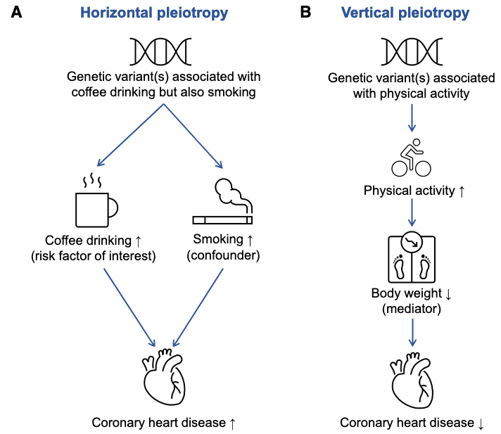
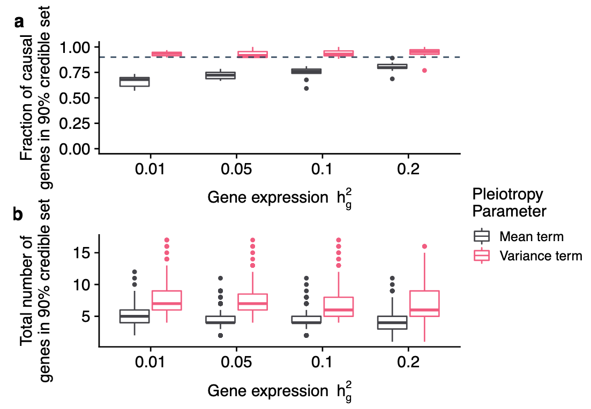
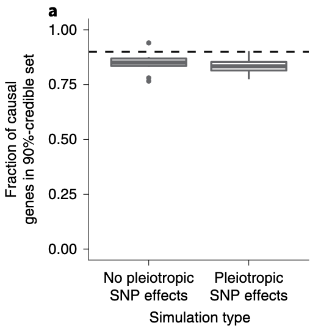
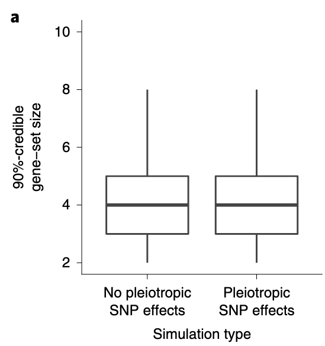

# Pleiotropic Effect and MRlink2

[toc]

## Pleiotropic effect

- Horizontal pleiotropy: a genetic variant affects the outcome through a pathway that does not involve the risk factor of interest.

- Vertical pleiotropy: when a genetic variant associates with another factor on the causal pathway from the genetic variants via risk factor to the outcome, such that any causal pathway from the variants to the outcome passes through the risk factor.

> However, distinguishing between horizontal and vertical pleiotropy is primarily dependent on our biological understanding of the relationships between the genetic variants, exposure, outcome, and pleiotropic factors.

## Pleiotropic effect in FOCUS

### Default model

We model the entire vector of marginal TWAS association statistics, using a multivariate Gaussian distribution parameterized by the effect sizes at causal genes $\bm\lambda_{\mathrm{pe}}$, residual SNP effects $\bm\lambda_{\mathrm{snp}}$, and the correlation structure  induced by inferred expression weights $\mathbf{\Omega}$ with LD $\mathbf{V}$ as

$$
\begin{equation}
\mathbf{z}_{\mathrm{twas}}|\bm\lambda_{\mathrm{snp}},\bm\lambda_{\mathrm{pe}},\bm\Omega,\mathbf{V}\sim N(\mathbf{\Omega}^{\mathrm{T}}\mathbf{V}\bm\lambda_{\mathrm{snp}}+\mathcal{V}\bm\lambda_{\mathrm{pe}},\mathbf{\Omega}^{\mathrm{T}}\mathbf{V}\mathbf{\Omega})
\end{equation}
$$
where $\bm\lambda_{\text{snp}}=\frac{\sqrt{n}}{\sigma_e}\bm\beta$. The default model for FOCUS controls for pleiotropic effects by including a mean term:

$$
\begin{align}
\bm\lambda_{\mathrm{snp}}=\mathbf{1}_p\lambda_{\mathrm{snp}}
\end{align}
$$

In the default model, we replace $\mathbf{z}$ above with the residual after regressing out the effect of $\hat{\lambda}_{\mathrm{snp}}$ estimated under the null $\mathbf{c}=\mathbf{0}$. This approach is  conservative but avoids estimating $\lambda_{\mathrm{snp}}$ for each causal configuration $\mathbf{c}$.

### Variance component model

Here, we describe a separate model that accounts for general random  pleiotropic effects at a region. If we model $\bm{\lambda}_{\mathrm{snp}}\sim N(\mathbf{0}, \mathbf{I}_p \sigma^2_p)$ and marginalize out $\bm{\lambda}_{\mathrm{snp}}$, the new marginal likelihood becomes:
$$
\begin{equation}
\mathbf{z}_{\mathrm{twas}}|\lambda_{\mathrm{snp}},\mathbf{\Omega},\mathbf{V},\mathbf{c},n\sigma_c^2,\sigma_p^2\sim N(\mathbf{0},n\sigma_p^2\mathbf{\Omega}^\mathrm{T}\mathbf{V}\mathbf{V}\mathbf{\Omega}+\mathcal{V}\mathbf{D}_c\mathcal{V}+\mathcal{V})
\end{equation}
$$

In the general setting $\sigma^2_p$ would need to be inferred before computing PIPs. We investigated performance of this variance components model **when $\sigma^2_p$ is known**:

We found the performance of the variance components model to produce unbiased credible sets but included many more genes on average compared with the mean term model.

### Simulation with pleiotropic effect

For standard simulations where pleiotropic SNP effects are uniform at each region, we sampled effects as $\beta \sim N(0, h^2_{pleio})$ and set $\bm\beta=\mathbf{1}_p\beta$.

 Our 'pleiotropic eQTL' simulation has SNP effects drawn independently and occurring only at a subset of eQTLs (rather than all SNPs) in the simulation. We first sampled 1–2 eQTLs per region and then sampled pleiotropic effect sizes as $\beta\sim N(0,h^2_{pleio}/p_{\mathrm{eQTL}})$ and set $\bm\beta$ to $\beta$ for selected eQTLs and 0 otherwise.

    

> FOCUS models an intercept term to control for pleiotropic SNP effects ($\bm{\lambda}_{\mathrm{snp}}$) tagged through predicted expression. In simulations where SNPs directly impacted downstream trait, we found a small decrease in performance (Fig. 3), which suggests that FOCUS maintains performance despite regressing out the average local effect.

## MR-link2 overview

MR-link2 is based on summary statistics from a single associated region and linkage disequilibrium (LD) information, simultaneously estimating the **causal effects** of exposure factors and the **pleiotropy** of SNPs. MR-link2 can robustly estimate pleiotropy when only a single associated region is available, making it suitable for causal inference of molecular phenotypes.

$$
\begin{align}
X & =G \cdot \boldsymbol{\gamma}^{(x)}+\epsilon_{x} \\
Y & =\alpha \cdot X+G \cdot \gamma^{(y)}+\epsilon_{y}
\end{align}
$$

Assume that the multivariate effect sizes come from a normal distribution: 
$$
\begin{align}
\boldsymbol{\gamma}^{(x)}&\sim \mathcal{N}(0,\sigma^2_x) \\
\boldsymbol{\gamma}^{(y)}&\sim \mathcal{N}(0,\sigma^2_y)
\end{align}
$$
Let $h^2_x$ and $h^2_y$ denote the direct local heritabilities of $X$ and $Y$, which determines $h^2_x=\sigma^2_x \cdot m$ and $h^2_y=\sigma^2_y \cdot m$, and the error variances as follows:
$$
\begin{align}
\epsilon_x&\sim \mathcal{N}(0,1-h^2_x) \\
\epsilon_y&\sim \mathcal{N}(0,1-\alpha^2-h_y^2)
\end{align}
$$

> MR-link-2 tests for two parameters using a likelihood ratio test: the causal effect estimate $\alpha$, which is of central interest, and the remaining horizontal pleiotropic variance, ${\hat h}^2_{y}$, which would otherwise violate the exclusion restriction.

