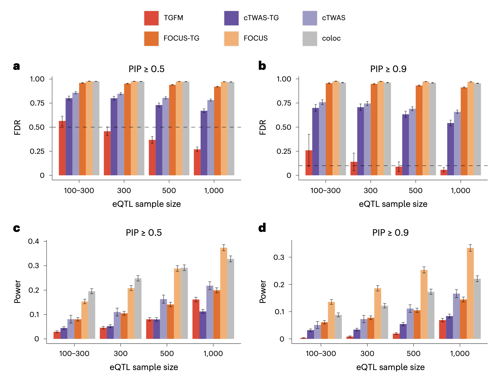
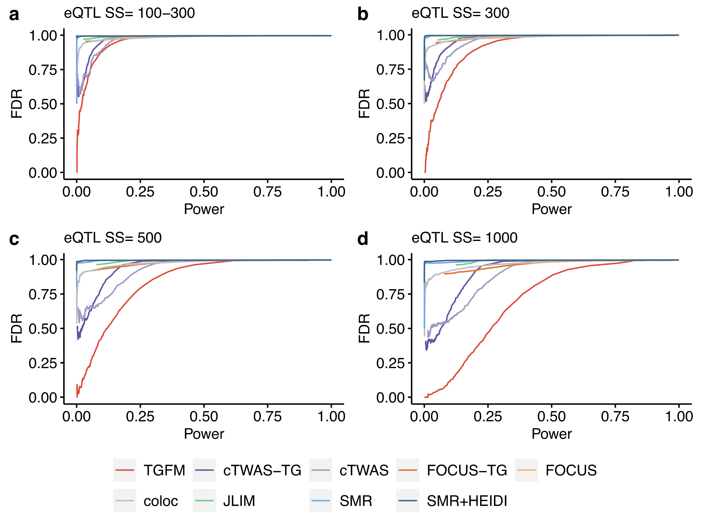
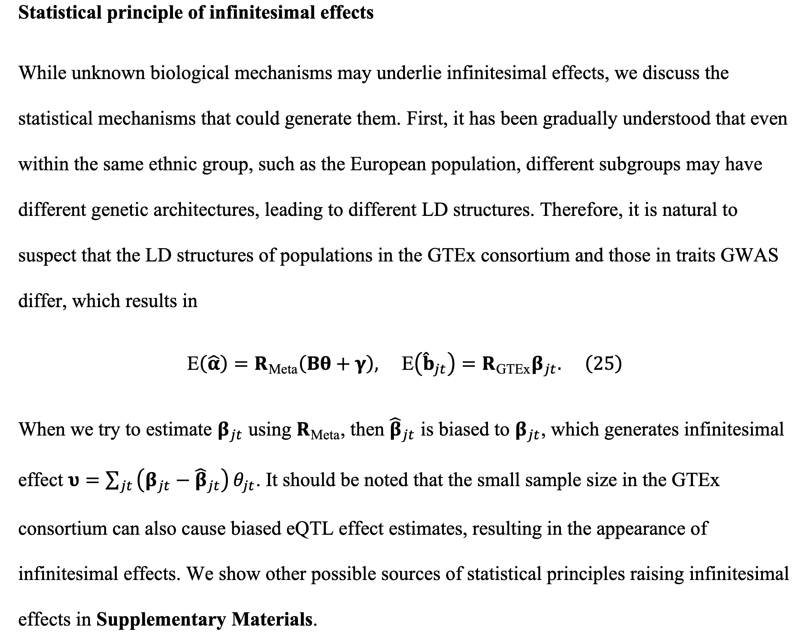
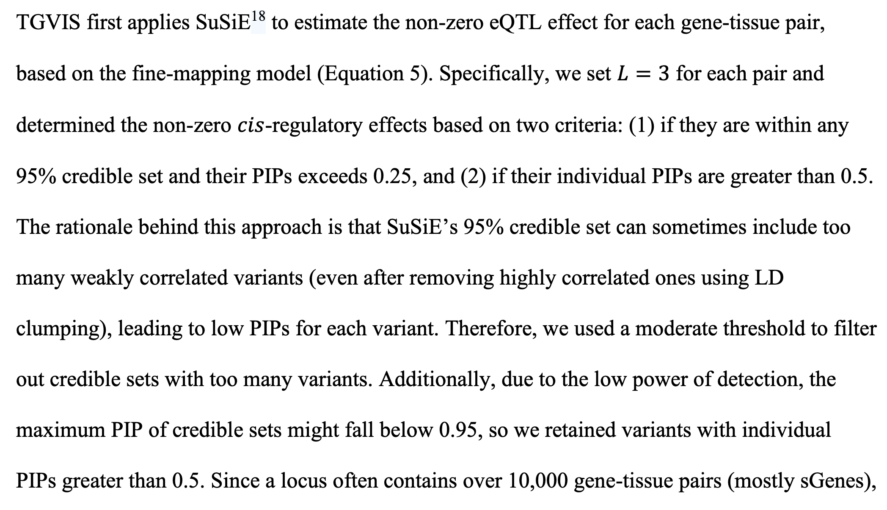
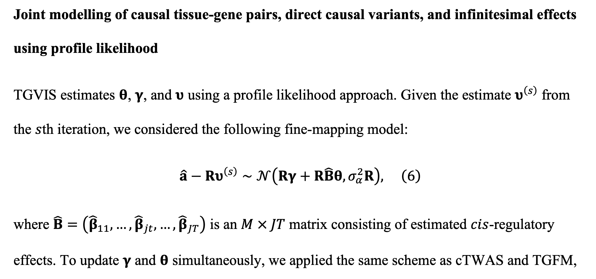

# Fine-mapping casual Tissue-Gene pairs

## TGFM

TGFM (Tissue–Gene Fine-Mapping), a method that infers the PIP for each gene–tissue pair to mediate a disease association at a given locus.

$$
\begin{equation}
\boldsymbol Y=\sum_g\sum_tX\boldsymbol\delta_{gt}\boldsymbol\alpha_{gt}+X\boldsymbol\beta+\epsilon
\end{equation}
$$
where $\boldsymbol Y$ denotes phenotypes, $\boldsymbol X$ is the matrix of genotypes, $g$ indexes genes, $t$ indexes tissues.

> TGFM consists of four steps:
> 
> In step 1, we apply SuSiE to perform eQTL fine-mapping of each gene–tissue pair in the external gene expression dataset (estimating a posterior distribution of the causal cis-eQTL effect sizes). 
> 
> In step 2, we randomly sample 100 cis-predicted expression models for each gene–tissue pair from the posterior distributions of causal cis-eQTL effect sizes estimated in step 1. 
> 
> In step 3, we apply SuSiE to perform disease fine-mapping in the target dataset (estimating the PIP of each genetic element) 100 times, iterating over the sampled cis-predicted expression models for each gene–tissue pair from step 2. 
> 
> In step 4, we average the results of step 3 across the 100 disease fine-mapping runs.

TGFM increases fine-mapping power by specifying tissue-specific prior probabilities for each genetic element in a locus that are informed by genome-wide data, analogous to functionally informed variant-level fine-mapping

TGFM assigns one prior causal probability, $\pi_t$, for each gene–tissue pair from tissue t and one prior causal probability, $\pi_{nm}$, for each non-mediated genetic variant. 

TGFM account for uncertainty in estimates of $\pi_t$ and $\pi_{nm}$ by using genomic bootstrapping, randomly sampling 100 sets of values of $\pi_t$ and $\pi_{nm}$ (one for each of the 100 disease fine-mapping runs in step 3) and averaging TGFM results across the random samples.

Calibration and power of tissue–gene fine-mapping methods in simulations:

Comparison of tissue-gene fine-mapping power at same level of FDR in simulations:

TGFM extends cTWAS to allow multiple tissues to be analyzed simultaneously and can identify the trait-relevant tissues beyond the causal variants and genes. However, Cui et al. recently reported that current Bayesian fine-mapping methods,  including SuSiE and FINEMAP, have a high replication failure rate (RFR) in practice. Cui et al. discovered that the widespread **infinitesimal effects**, which may **stem from the  polygenicity of complex traits**, are the sources of the high RFR, and accounting for the infinitesimal effects can reduce the RFR and improve statistical power.

## TGVIS

TGVIS (Tissue-Gene pairs, direct causal Variants, and Infinitesimal effects Selector), a multivariable TWAS method to identify tissue-specific causal genes and direct causal variants while accounting for infinitesimal effects:

$$
\begin{equation}
\mathbf{y}=\sum_{j=1}^J\sum_{t=1}^TX_{jt}\theta_{jt}+\mathbf{G}^\top(\boldsymbol{\gamma}+\boldsymbol{v})+\varepsilon
\end{equation}
$$

> Infinitesimal effect: The infinitesimal model, also known as the polygenic model, is a widely used statistical model in quantitative genetics and in genome-wide association studies. It is based on the idea that variation in a quantitative trait is influenced by an infinitely large number of genes, each of which makes an infinitely small (infinitesimal) contribution to the phenotype, as well as by environmental factors
>
> Complex traits, however, have been shown to be largely explained by additive effects, with dominance being of negligible importance, though dominance and epistasis are still relevant for rare Mendelian disorders.
>
> 

To resolve this curse of dimensionality, they utilized the three sparsity conditions that are commonly assumed in current fine-mapping methods:

- Sparsity Condition 1: **one or small number of variants  causally contribute to tissue or cell-type specific gene expression**.

- Sparsity Condition 2: **one or small number of gene-tissue pairs causally contribute to the trait**.

- Sparsity Condition 3: **one or small number of direct  causal variants exist with relatively large effect sizes**.

In addition, they incorporated that **variants can have infinitesimal effects**: $\boldsymbol v$ is normally distributed with a mean 0 and a small, unknown variance.

> To estimate the non-zero eQTL effect, TGVIS applies SuSiE and fixed $L=3$:
> 
> 

> TGVIS estimates $\boldsymbol{\theta}, \boldsymbol{\gamma}$ and $\boldsymbol{\nu}$ by profile likelihood approach, and estimates the variance by REML.
> 
> 

